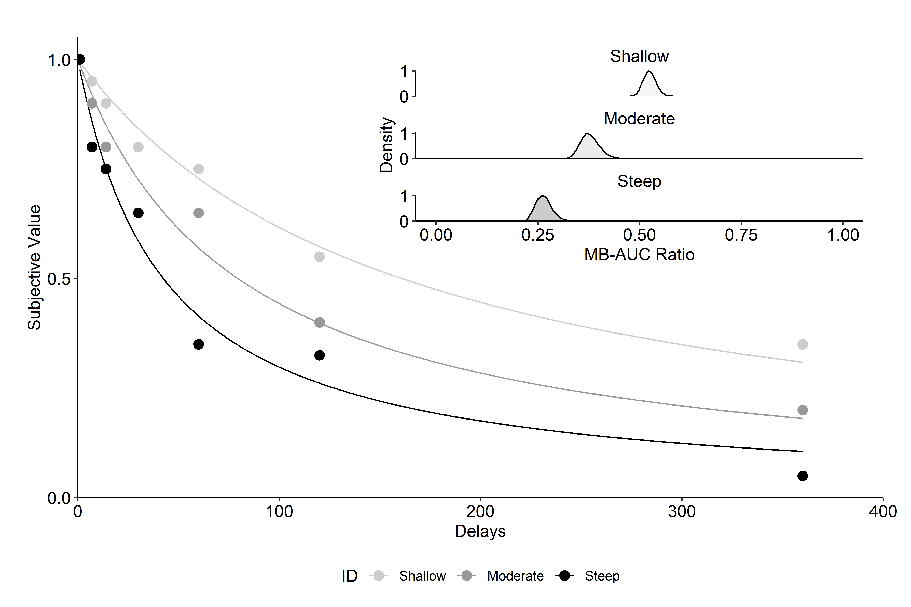

Exact-Solution-Model-Area
================
Shawn Gilroy
09/05/2019

Change log:

  - 11/13/2022: Updated pre-print

  - 9/5/2019: Archived pre-print

## Figure 1

<!-- -->

## Figure 2

<!-- -->

## Figure 3

<!-- -->

## Figure 4

    ## 
    ##  Wilcoxon rank sum test
    ## 
    ## data:  sim_values$NI.AUC and sim_values$Exact.AUC
    ## W = 1249704488, p-value = 0.9484
    ## alternative hypothesis: true location shift is not equal to 0

    ## 
    ##  Spearman's rank correlation rho
    ## 
    ## data:  sim_values$NI.AUC and sim_values$Exact.AUC
    ## S = 9470313, p-value < 2.2e-16
    ## alternative hypothesis: true rho is not equal to 0
    ## sample estimates:
    ##       rho 
    ## 0.9999995

    ## 
    ##  Wilcoxon rank sum test
    ## 
    ## data:  sim_values[sim_values$Model == "Noise", "NI.AUC"] and sim_values[sim_values$Model == "Noise", "Exact.AUC"]
    ## W = 672805, p-value = 0.9998
    ## alternative hypothesis: true location shift is not equal to 0

    ## 
    ##  Spearman's rank correlation rho
    ## 
    ## data:  sim_values[sim_values$Model == "Noise", "NI.AUC"] and sim_values[sim_values$Model == "Noise", "Exact.AUC"]
    ## S = 0.5, p-value < 2.2e-16
    ## alternative hypothesis: true rho is not equal to 0
    ## sample estimates:
    ## rho 
    ##   1

    ## 
    ##  Wilcoxon rank sum test
    ## 
    ## data:  sim_values[sim_values$Model == "Exponential", "NI.AUC"] and sim_values[sim_values$Model == "Exponential", "Exact.AUC"]
    ## W = 39214417, p-value = 0.9999
    ## alternative hypothesis: true location shift is not equal to 0

    ## 
    ##  Spearman's rank correlation rho
    ## 
    ## data:  sim_values[sim_values$Model == "Exponential", "NI.AUC"] and sim_values[sim_values$Model == "Exponential", "Exact.AUC"]
    ## S = 22, p-value < 2.2e-16
    ## alternative hypothesis: true rho is not equal to 0
    ## sample estimates:
    ## rho 
    ##   1

    ## 
    ##  Wilcoxon rank sum test
    ## 
    ## data:  sim_values[sim_values$Model == "Hyperbolic", "NI.AUC"] and sim_values[sim_values$Model == "Hyperbolic", "Exact.AUC"]
    ## W = 60709209, p-value = 1
    ## alternative hypothesis: true location shift is not equal to 0

    ## 
    ##  Spearman's rank correlation rho
    ## 
    ## data:  sim_values[sim_values$Model == "Hyperbolic", "NI.AUC"] and sim_values[sim_values$Model == "Hyperbolic", "Exact.AUC"]
    ## S = 27.5, p-value < 2.2e-16
    ## alternative hypothesis: true rho is not equal to 0
    ## sample estimates:
    ## rho 
    ##   1

    ## 
    ##  Wilcoxon rank sum test
    ## 
    ## data:  sim_values[sim_values$Model == "Quasi-Hyperbolic", "NI.AUC"] and sim_values[sim_values$Model == "Quasi-Hyperbolic", "Exact.AUC"]
    ## W = 60821631, p-value = 0.7656
    ## alternative hypothesis: true location shift is not equal to 0

    ## 
    ##  Spearman's rank correlation rho
    ## 
    ## data:  sim_values[sim_values$Model == "Quasi-Hyperbolic", "NI.AUC"] and sim_values[sim_values$Model == "Quasi-Hyperbolic", "Exact.AUC"]
    ## S = 109894, p-value < 2.2e-16
    ## alternative hypothesis: true rho is not equal to 0
    ## sample estimates:
    ##       rho 
    ## 0.9999995

    ## 
    ##  Wilcoxon rank sum test
    ## 
    ## data:  sim_values[sim_values$Model == "Myerson-Green", "NI.AUC"] and sim_values[sim_values$Model == "Myerson-Green", "Exact.AUC"]
    ## W = 18647732, p-value = 1
    ## alternative hypothesis: true location shift is not equal to 0

    ## 
    ##  Spearman's rank correlation rho
    ## 
    ## data:  sim_values[sim_values$Model == "Myerson-Green", "NI.AUC"] and sim_values[sim_values$Model == "Myerson-Green", "Exact.AUC"]
    ## S = 16.5, p-value < 2.2e-16
    ## alternative hypothesis: true rho is not equal to 0
    ## sample estimates:
    ## rho 
    ##   1

    ## 
    ##  Wilcoxon rank sum test
    ## 
    ## data:  sim_values[sim_values$Model == "Rachlin", "NI.AUC"] and sim_values[sim_values$Model == "Rachlin", "Exact.AUC"]
    ## W = 69809132, p-value = 0.9997
    ## alternative hypothesis: true location shift is not equal to 0

    ## 
    ##  Spearman's rank correlation rho
    ## 
    ## data:  sim_values[sim_values$Model == "Rachlin", "NI.AUC"] and sim_values[sim_values$Model == "Rachlin", "Exact.AUC"]
    ## S = 563, p-value < 2.2e-16
    ## alternative hypothesis: true rho is not equal to 0
    ## sample estimates:
    ## rho 
    ##   1

<!-- -->

## Figure 5

<!-- -->

## Figure 6

<!-- -->

    ## 
    ## Cohen's d
    ## 
    ## d estimate: -1.093795 (large)
    ## 95 percent confidence interval:
    ##     lower     upper 
    ## -1.107324 -1.080266
